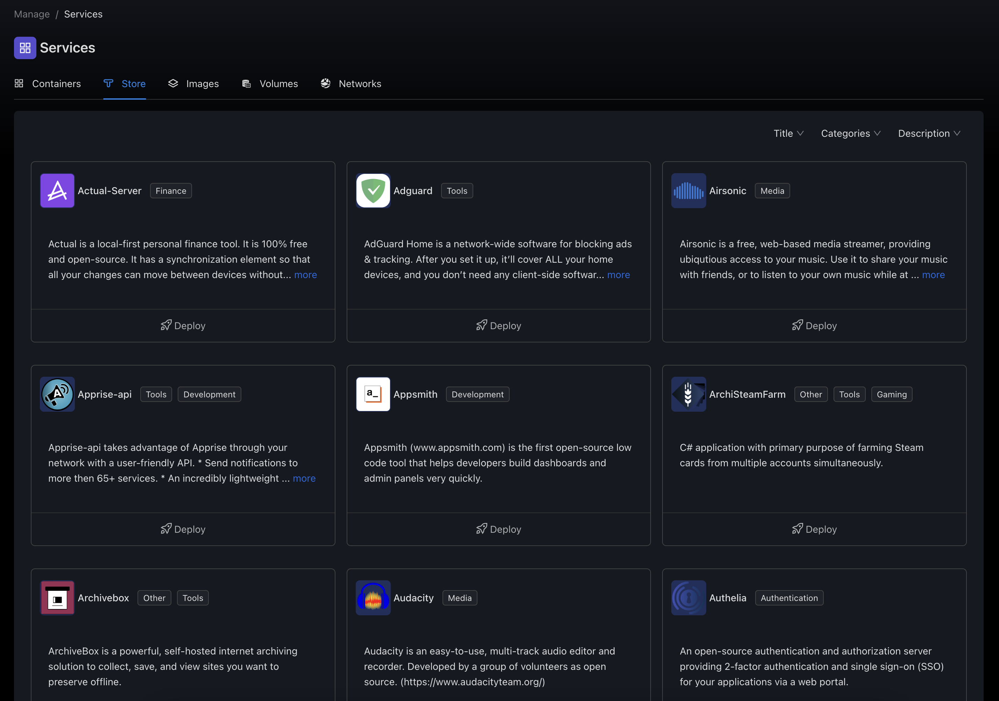
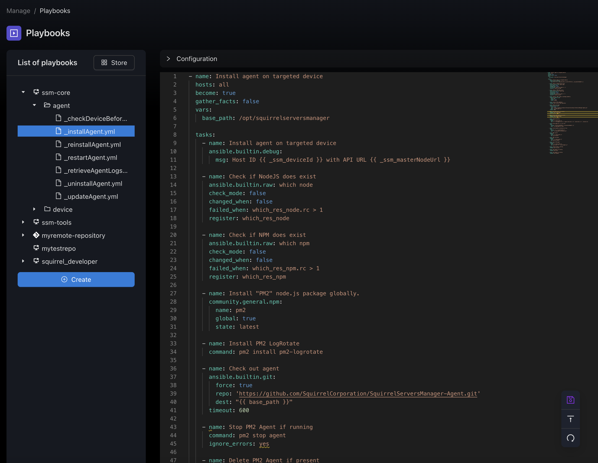
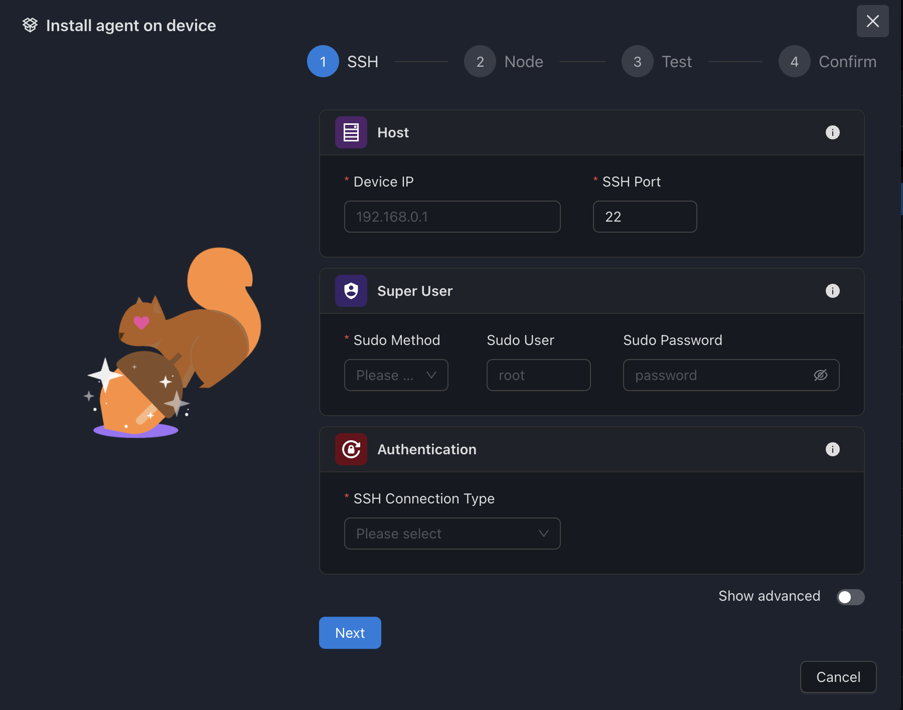

<div align="center">
  <a href="https://squirrelserversmanager.io">
    
  </a>
  
  <br />
  <br />
  
  <h1>🐿️ Squirrel Servers Manager</h1>
  
  <p align="center">
    <b>The beautiful, user-friendly server management platform you've been waiting for</b>
  </p>
  
  <p align="center">
    All-in-one configuration and container management, powered by Ansible, Docker & Prometheus
  </p>

  <br />

  <!-- Navigation -->
  <p align="center">
    <a href="https://squirrelserversmanager.io"><b>Website</b></a> •
    <a href="https://squirrelserversmanager.io/docs"><b>Documentation</b></a> •
    <a href="https://demo.squirrelserversmanager.io"><b>Live Demo</b></a> •
    <a href="#-quickstart"><b>Quick Start</b></a> •
    <a href="#-features"><b>Features</b></a> •
    <a href="#-community"><b>Community</b></a>
  </p>

  <br />

  <!-- Badges -->
  <p align="center">
    <a href="https://github.com/SquirrelCorporation/SquirrelServersManager/actions/workflows/docker-publish.yml">
      
    </a>
    <a href="https://github.com/SquirrelCorporation/SquirrelServersManager/actions/workflows/test-client.yml">
      
    </a>
    <a href="https://github.com/SquirrelCorporation/SquirrelServersManager/actions/workflows/test-server.yml">
      
    </a>
    <a href="https://github.com/SquirrelCorporation/SquirrelServersManager/actions/workflows/test-playbooks.yml">
      
    </a>
  </p>

  <p align="center">
    
    
    
    
  </p>

  <br />

  <!-- Hero Screenshot -->
  
</div>

<br />

---

## 🎯 Why Squirrel Servers Manager?

### 🎨 **Beautiful UI/UX First**
> Unlike traditional server management tools, SSM prioritizes user experience with a modern, intuitive interface that makes complex tasks simple.

### 🔓 **100% Open Source**
> No vendor lock-in, no hidden costs. SSM is completely open source and free forever. Run it on your infrastructure, your way.

### 🔧 **All-in-One Solution**
> Stop juggling multiple tools. SSM combines container management, configuration automation, monitoring, and more in a single platform.

### 🚀 **Easy to Get Started**
> One command to install, intuitive onboarding, and sensible defaults. Get up and running in minutes, not hours.

<br />

## ⚡ QuickStart

### 🎯 One-Line Install (Recommended)

```bash
curl https://raw.githubusercontent.com/SquirrelCorporation/SquirrelServersManager/master/getSSM.sh | bash
```

> 🔗 See the [full installation guide](https://squirrelserversmanager.io/docs/getting-started) for detailed instructions

### 🐳 Docker Compose Install

<details>
<summary><b>Production Setup</b></summary>

```bash
# 1. Clone the repository
git clone https://github.com/SquirrelCorporation/SquirrelServersManager.git
cd SquirrelServersManager

# 2. Configure your environment
cp .env.example .env
# Edit .env with your settings

# 3. Start SSM
docker compose up -d

# 🎉 Access SSM at http://localhost:3000
```

</details>

<details>
<summary><b>Development Setup</b></summary>

```bash
# 1. Clone the repository
git clone https://github.com/SquirrelCorporation/SquirrelServersManager.git
cd SquirrelServersManager

# 2. Configure your environment
cp .env.example .env
# Edit .env with your settings

# 3. Start development environment
docker compose -f docker-compose.dev.yml up

# 🔧 Development server with hot reload at http://localhost:3000
```

</details>

<br />

## ✨ Features

### 📊 **Metrics & Monitoring**
Real-time CPU, RAM, disk, and network monitoring with anomaly detection and beautiful dashboards.

### 🐳 **Container Management**
Full Docker integration - manage containers, monitor stats, handle multi-registry authentication, and receive update notifications.

### 📚 **Ansible Playbooks**
Execute and manage Ansible playbooks with a beautiful interface, Git integration, and real-time execution logs.

### 🤖 **Automations**
Create powerful automation workflows triggered by events, schedules, or system conditions.

### 🔐 **Enterprise Security**
Ansible Vault integration, encrypted credential storage, SSH key management, and role-based access control.

### 📦 **Service Collections**
Deploy popular open-source services with one click from our curated collection.

<br />

## 🖼️ Screenshots

<details>
<summary><b>View All Screenshots</b></summary>

#### Devices Overview


#### Services Management


#### Service Store


#### Playbook Execution


#### Device Details


#### Add New Device


</details>

<br />

## 🏗️ Tech Stack

**Frontend:**
React 18 • TypeScript • Ant Design Pro • WebSocket

**Backend:**
NestJS • MongoDB • Redis • WebSocket • Clean Architecture

**Infrastructure:**
Docker • Ansible • Prometheus • Node Exporter

<br />

## 🚀 Roadmap

### ✅ **Current (Alpha)**
- Core device management
- Container orchestration
- Ansible integration
- Basic automations
- Real-time monitoring

### 🚧 **Beta (Q1 2025)**
- Plugin system
- Advanced automations
- Multi-user improvements
- Mobile app
- Kubernetes support

### 🔮 **Future**
- Cloud sync
- AI-powered insights
- Terraform integration
- Advanced RBAC
- Enterprise features

<br />

## 🤝 Community

### 💬 Get Help & Connect

[](https://discord.gg/your-discord)
[](https://github.com/SquirrelCorporation/SquirrelServersManager/discussions)
[](https://twitter.com/your-twitter)

### 🌟 Contributing

We love contributions! Whether it's:
- 🐛 Bug reports
- 💡 Feature requests
- 📖 Documentation improvements
- 🔧 Code contributions

See our [Contributing Guide](./CONTRIBUTING.md) to get started.

### 🏆 Contributors

<a href="https://github.com/SquirrelCorporation/SquirrelServersManager/graphs/contributors">
  
</a>

<br />

## 🛡️ Security

- 🔐 All secrets encrypted with Ansible Vault
- 🔑 SSH key management with encryption
- 🛡️ Role-based access control
- 📝 Audit logging
- 🔒 HTTPS/TLS support

Found a security issue? Please email security@squirrelserversmanager.io

<br />

## 📊 Telemetry

SSM collects anonymous usage statistics to help improve the product. This data:
- ✅ Is completely anonymous
- ✅ Contains no sensitive information
- ✅ Helps us understand usage patterns
- ✅ Can be disabled anytime

To opt-out, set `TELEMETRY_ENABLED=false` in your `.env` file.

<br />

## ⚖️ License

Squirrel Servers Manager is licensed under the [GNU Affero General Public License v3.0](./LICENSE).

<br />

## 🙏 Acknowledgments

Built with amazing open-source projects including NestJS, React, Ansible, Docker, MongoDB, and many more.

Special thanks to all our contributors, early adopters, testers, and the open-source community.

---

<div align="center">
  <br />
  
  <br />
  <br />
  <p>
    <b>Made with 🥜 by the Squirrel Corporation team</b>
  </p>
  <p>
    <i>Building the future of server management, one nut at a time</i>
  </p>
</div>