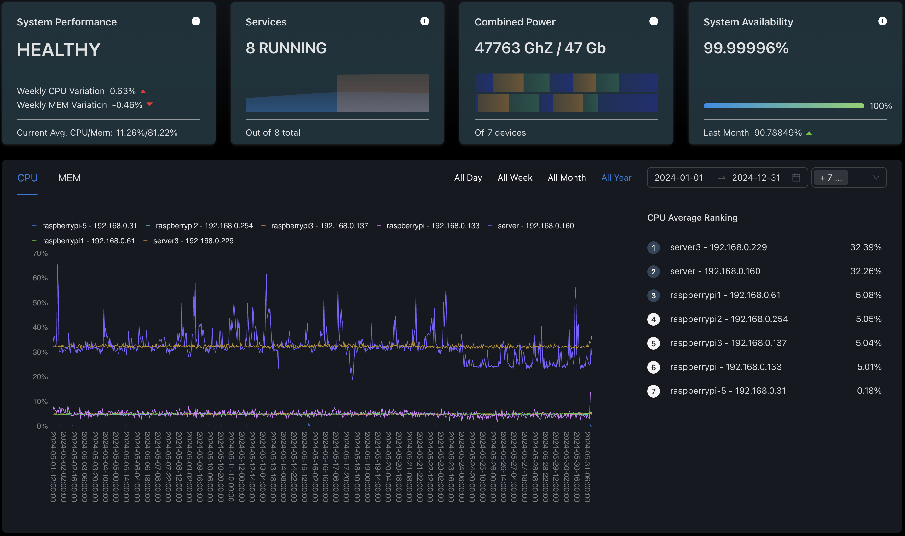

<div align="center">
  <a href="https://squirrelserversmanager.io">
    
  </a>
  
  <br />
  <br />
  
  <h1>🐿️ Squirrel Servers Manager</h1>
  
  <p align="center">
    <b>The beautiful, user-friendly server management platform you've been waiting for</b>
  </p>
  
  <p align="center">
    All-in-one configuration and container management, powered by Ansible, Docker & Prometheus
  </p>

  <br />

  <!-- Navigation -->
  <p align="center">
    <a href="https://squirrelserversmanager.io"><b>Website</b></a> •
    <a href="https://squirrelserversmanager.io/docs"><b>Documentation</b></a> •
    <a href="https://demo.squirrelserversmanager.io"><b>Live Demo</b></a> •
    <a href="#-quickstart"><b>Quick Start</b></a> •
    <a href="#-features"><b>Features</b></a> •
    <a href="#-community"><b>Community</b></a>
  </p>

  <br />

  <!-- Badges -->
  <p align="center">
    <a href="https://github.com/SquirrelCorporation/SquirrelServersManager/actions/workflows/docker-publish.yml">
      
    </a>
    <a href="https://github.com/SquirrelCorporation/SquirrelServersManager/actions/workflows/test-client.yml">
      
    </a>
    <a href="https://github.com/SquirrelCorporation/SquirrelServersManager/actions/workflows/test-server.yml">
      
    </a>
    <a href="https://github.com/SquirrelCorporation/SquirrelServersManager/actions/workflows/test-playbooks.yml">
      
    </a>
  </p>

  <p align="center">
    
    
    
    
  </p>

  <br />

  <!-- Hero Screenshot -->
  
</div>

<br />

---

## 🎯 Why Squirrel Servers Manager?

<table>
<tr>
<td width="50%">

### 🎨 **Beautiful UI/UX First**
Unlike traditional server management tools, SSM prioritizes user experience with a modern, intuitive interface that makes complex tasks simple.

</td>
<td width="50%">

### 🔓 **100% Open Source**
No vendor lock-in, no hidden costs. SSM is completely open source and free forever. Run it on your infrastructure, your way.

</td>
</tr>
<tr>
<td width="50%">

### 🔧 **All-in-One Solution**
Stop juggling multiple tools. SSM combines container management, configuration automation, monitoring, and more in a single platform.

</td>
<td width="50%">

### 🚀 **Easy to Get Started**
One command to install, intuitive onboarding, and sensible defaults. Get up and running in minutes, not hours.

</td>
</tr>
</table>

<br />

## ⚡ QuickStart

### 🎯 One-Line Install (Recommended)

```bash
curl https://raw.githubusercontent.com/SquirrelCorporation/SquirrelServersManager/master/getSSM.sh | bash
```

> 🔗 See the [full installation guide](https://squirrelserversmanager.io/docs/getting-started) for detailed instructions

### 🐳 Docker Compose Install

<details>
<summary><b>Production Setup</b></summary>

```bash
# 1. Clone the repository
git clone https://github.com/SquirrelCorporation/SquirrelServersManager.git
cd SquirrelServersManager

# 2. Configure your environment
cp .env.example .env
# Edit .env with your settings

# 3. Start SSM
docker compose up -d

# 🎉 Access SSM at http://localhost:3000
```

</details>

<details>
<summary><b>Development Setup</b></summary>

```bash
# 1. Clone the repository
git clone https://github.com/SquirrelCorporation/SquirrelServersManager.git
cd SquirrelServersManager

# 2. Configure your environment
cp .env.example .env
# Edit .env with your settings

# 3. Start development environment
docker compose -f docker-compose.dev.yml up

# 🔧 Development server with hot reload at http://localhost:3000
```

</details>

<br />

## ✨ Features

### 🔥 Core Capabilities

<table align="center">
<tr>
<td align="center" width="33%">
  
  <h4>📊 Metrics & Monitoring</h4>
  <p>Real-time CPU, RAM, disk, and network monitoring with anomaly detection</p>
</td>
<td align="center" width="33%">
  
  <h4>🐳 Container Management</h4>
  <p>Manage Docker containers, monitor stats, and get update notifications</p>
</td>
<td align="center" width="33%">
  
  <h4>📚 Ansible Playbooks</h4>
  <p>Execute and manage Ansible playbooks with a beautiful interface</p>
</td>
</tr>
<tr>
<td align="center" width="33%">
  
  <h4>🤖 Automations</h4>
  <p>Trigger actions based on events, schedules, or system conditions</p>
</td>
<td align="center" width="33%">
  
  <h4>🔐 Enterprise Security</h4>
  <p>Ansible Vault integration, encrypted secrets, and role-based access</p>
</td>
<td align="center" width="33%">
  
  <h4>📦 Service Collections</h4>
  <p>One-click deployment of popular open-source services</p>
</td>
</tr>
</table>

### 🎯 Key Features In Detail

<details>
<summary><b>🖥️ Device Management</b></summary>

- SSH connection management with key-based authentication
- Real-time system metrics and health monitoring
- Batch operations across multiple devices
- Custom device grouping and tagging
- Automated health checks and alerts

</details>

<details>
<summary><b>🐳 Container Orchestration</b></summary>

- Full Docker API integration
- Container lifecycle management (start, stop, restart, remove)
- Real-time logs and statistics
- Multi-registry support (Docker Hub, GHCR, private registries)
- Automatic update detection and notifications
- Docker Compose support

</details>

<details>
<summary><b>📚 Configuration Management</b></summary>

- Ansible playbook execution with real-time output
- Git-based playbook repositories
- Dynamic inventory management
- Ansible Galaxy collections support
- Vault integration for secrets
- Execution history and logs

</details>

<details>
<summary><b>🤖 Automation Engine</b></summary>

- Event-driven automation triggers
- Cron-based scheduling
- Custom automation workflows
- Integration with external webhooks
- Conditional execution logic
- Notification actions

</details>

<br />

## 📸 Screenshots

<details>
<summary><b>View More Screenshots</b></summary>

<table>
<tr>
<td></td>
<td></td>
</tr>
<tr>
<td></td>
<td></td>
</tr>
<tr>
<td></td>
<td></td>
</tr>
</table>

</details>

<br />

## 🏗️ Architecture

<div align="center">
  
</div>

### Tech Stack

<table>
<tr>
<td align="center">

**Frontend**
- React 18
- Ant Design Pro
- TypeScript
- WebSocket

</td>
<td align="center">

**Backend**
- NestJS
- MongoDB
- Redis
- WebSocket

</td>
<td align="center">

**Infrastructure**
- Docker
- Ansible
- Prometheus
- Node Exporter

</td>
</tr>
</table>

<br />

## 🚀 Roadmap

<table>
<tr>
<td>

### ✅ Current (Alpha)
- [x] Core device management
- [x] Container orchestration
- [x] Ansible integration
- [x] Basic automations
- [x] Real-time monitoring

</td>
<td>

### 🚧 Beta (Q1 2025)
- [ ] Plugin system
- [ ] Advanced automations
- [ ] Multi-user improvements
- [ ] Mobile app
- [ ] Kubernetes support

</td>
<td>

### 🔮 Future
- [ ] Cloud sync
- [ ] AI-powered insights
- [ ] Terraform integration
- [ ] Advanced RBAC
- [ ] Enterprise features

</td>
</tr>
</table>

<br />

## 🤝 Community

### 💬 Get Help & Connect

<p align="center">
  <a href="https://discord.gg/your-discord">
    
  </a>
  <a href="https://github.com/SquirrelCorporation/SquirrelServersManager/discussions">
    
  </a>
  <a href="https://twitter.com/your-twitter">
    
  </a>
</p>

### 🌟 Contributing

We love contributions! Whether it's:
- 🐛 Bug reports
- 💡 Feature requests
- 📖 Documentation improvements
- 🔧 Code contributions

See our [Contributing Guide](./CONTRIBUTING.md) to get started.

### 🏆 Contributors

<a href="https://github.com/SquirrelCorporation/SquirrelServersManager/graphs/contributors">
  
</a>

<br />

## 🛡️ Security

- 🔐 All secrets encrypted with Ansible Vault
- 🔑 SSH key management with encryption
- 🛡️ Role-based access control
- 📝 Audit logging
- 🔒 HTTPS/TLS support

Found a security issue? Please email security@squirrelserversmanager.io

<br />

## 📊 Telemetry

SSM collects anonymous usage statistics to help improve the product. This data:
- ✅ Is completely anonymous
- ✅ Contains no sensitive information
- ✅ Helps us understand usage patterns
- ✅ Can be disabled anytime

To opt-out, set `TELEMETRY_ENABLED=false` in your `.env` file.

<br />

## ⚖️ License

Squirrel Servers Manager is licensed under the [GNU Affero General Public License v3.0](./LICENSE).

<br />

## 🙏 Acknowledgments

<table>
<tr>
<td align="center">

Built with amazing open-source projects:
- NestJS
- React
- Ansible
- Docker
- MongoDB
- And many more...

</td>
<td align="center">

Special thanks to:
- All our contributors
- Early adopters and testers
- The open-source community
- You, for checking out SSM! 

</td>
</tr>
</table>

---

<div align="center">
  <br />
  
  <br />
  <br />
  <p>
    <b>Made with 🥜 by the Squirrel Corporation team</b>
  </p>
  <p>
    <i>Building the future of server management, one nut at a time</i>
  </p>
</div>