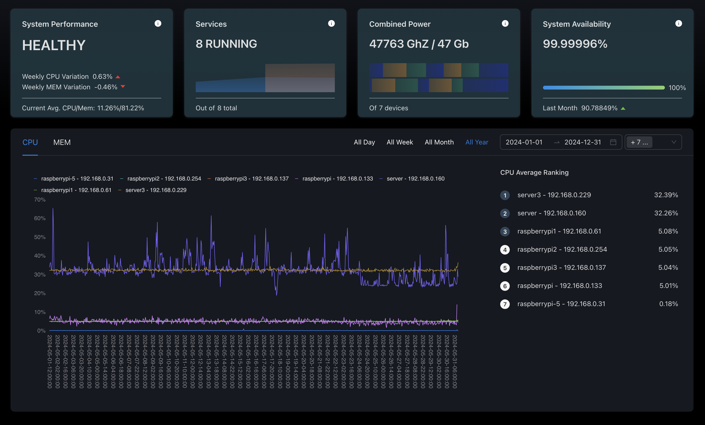
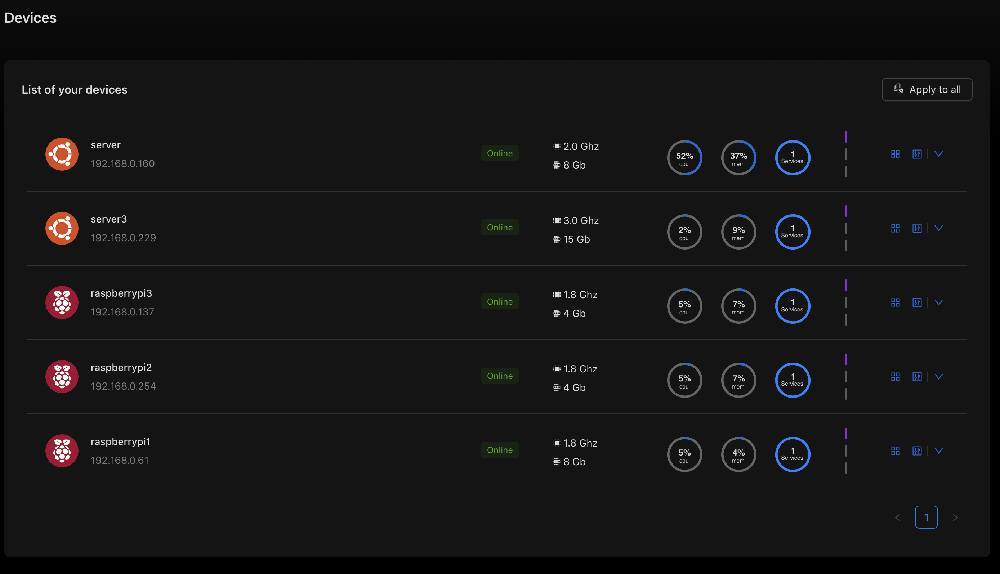
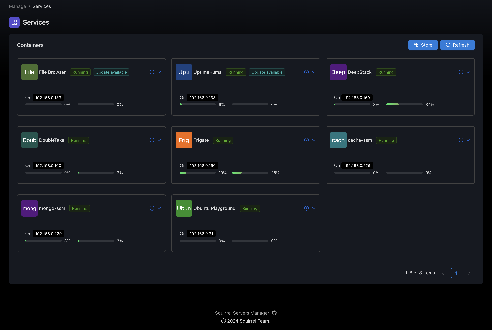

# SQUIRREL SERVERS MANAGER
https://squirrelserversmanager.io

[](https://github.com/SquirrelCorporation/SquirrelServersManager/actions/workflows/docker-publish.yml)
[](https://github.com/SquirrelCorporation/SquirrelServersManager/actions/workflows/node.js.yml)

NOTE:
This is a Alpha version, It may not work on your system. I am currently looking for testers and contributors.
Absolutely no warranties. 

See https://squirrelserversmanager.io/docs/quickstart
**Edit the .env file before anything**

## Production
```console
docker compose up
```

## Developement
```console
docker compose up -f docker-compose.dev.yml up 
```

## Main features:
|                                                  | Features                               | Description                                                                                                                                                                  |
|:------------------------------------------------:|:---------------------------------------|:-----------------------------------------------------------------------------------------------------------------------------------------------------------------------------|
|               | **Metrics & Statistics**               | :white_circle: Follow the main metrics of your servers (CPU, RAM, ...) and detect anomalies                                                                                  |
|       | **Playbooks management and execution** | :white_circle: Manage your playbooks, locally and remotely and run them on your devices                                                                                      |
|                 | **Container Management**               | :white_circle: See all running containers, statistics and be alerted when a update is available                                                                              |
|     | **Automations**                        | :white_circle: Run actions on trigger like playbooks execution or container actions                                                                                          |
|                   | **Security**                           | :white_circle: We do our best to ensure your secrets and authentication info are well kept with Ansible Vault and Bcrypt                                                     | 
|  | **Advanced configuration**             | :white_circle: Even though SSM is made to be userfriendly and easy to use as possible, because every setup is different, you can set up advanced options fitting your needs. | 
|     | **Integrations** (Coming soon)         | :white_circle: Be able to trigger automations from others tools, as well as call other services                                                                              | 
|            | **Collections** (Coming soon)          | :white_circle: Install on your devices in one click from a collection of open source services                                                                                | 


## Screenshots




