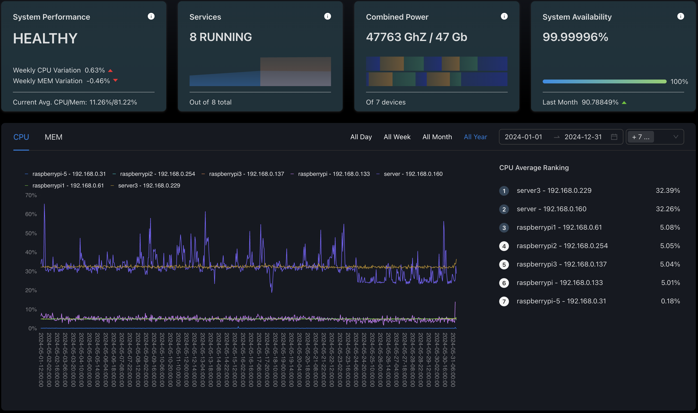
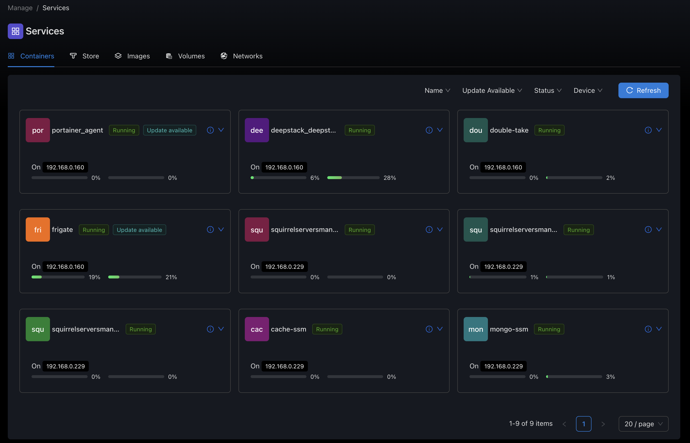
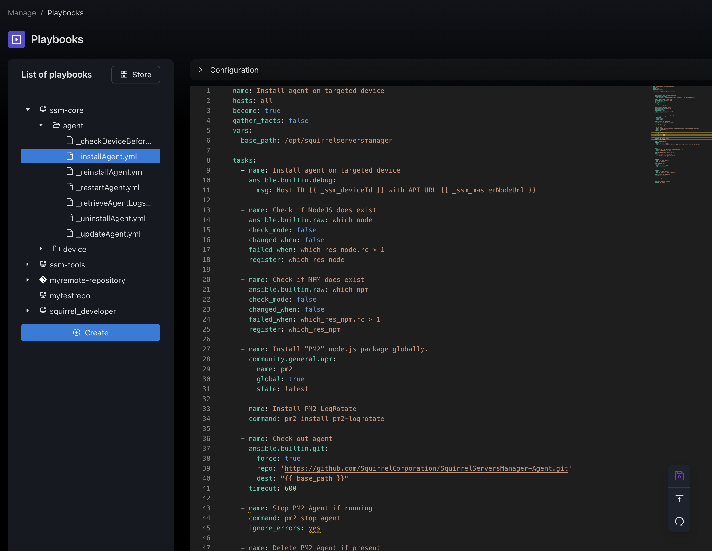

# Squirrel Servers Manager
[Website](https://squirrelserversmanager.io) - [Documentation](https://squirrelserversmanager.io/docs) - [Demo](https://demo.squirrelserversmanager.io) 


Squirrel Servers Manager is an all-in-one configuration and container management tool, powered by Ansible, Docker & Prometheus, with a focus on UI/UX.
It is designed to provide a user-friendly alternative to well-known established tools, while being totally open-source and free.

[](https://github.com/SquirrelCorporation/SquirrelServersManager/actions/workflows/docker-publish.yml)
[](https://github.com/SquirrelCorporation/SquirrelServersManager/actions/workflows/test-client.yml)
[](https://github.com/SquirrelCorporation/SquirrelServersManager/actions/workflows/test-server.yml)
[](https://github.com/SquirrelCorporation/SquirrelServersManager/actions/workflows/test-playbooks.yml)

<p align="center">
	
</p>

---

## 🔥 Main Features:

|                                                                                                | Features                                | Description                                                                                                   |
|:----------------------------------------------------------------------------------------------:|:---------------------------------------|:-------------------------------------------------------------------------------------------------------------|
|                     | **Metrics & Statistics**               | :white_circle: Monitor the main metrics of your servers (CPU, RAM, etc.) and detect anomalies                 |
|             | **Playbooks Management & Execution** | :white_circle: Manage your playbooks, both locally and remotely, and run them on your devices                 |
|            | **Container Management**               | :white_circle: View all running containers, monitor their statistics, and receive alerts when updates are available |
|          | **Automations**                        | :white_circle: Run actions on triggers like playbook execution or container actions                           |
|                         | **Security**                           | :white_circle: We ensure your secrets and authentication info are secure using Ansible Vault and Bcrypt       |
|  | **Advanced Configuration**             | :white_circle: User-friendly with advanced options to fit your specific needs                                 |
|                 | **Integrations** (Coming soon)         | :white_circle: Trigger automations from other tools and call other services                                   |
|                       | **Collections**                        | :white_circle: Install open source services on your devices with one click                                    |

---

## 🏎️ QuickStart
```shell
curl https://raw.githubusercontent.com/SquirrelCorporation/SquirrelServersManager/refs/heads/master/getSSM.sh | bash
```
See [QuickStart](https://squirrelserversmanager.io/docs/getting-started)


For the others methods, **[Edit the `.env` file before anything](https://squirrelserversmanager.io/docs/getting-started/installation#step-2-create-env-file).**

---

## 🛳️ Manual Install: Production
Clone the project, [edit the `.env`](https://squirrelserversmanager.io/docs/getting-started/installation#step-2-create-env-file) file and run:
```shell
docker compose up
```

## 🏗️ Manual Install: Development
Clone the project, [edit the `.env`](https://squirrelserversmanager.io/docs/getting-started/installation#step-2-create-env-file) file and run:
```shell
docker compose -f docker-compose.dev.yml up
```

## 🚧 Troubleshoot
See [Troubleshoot](https://squirrelserversmanager.io/docs/troubleshoot/troubleshoot)

---

## 💌 Screenshots







---
## Disabling Anonymized Telemetry

By default, SSM automatically reports anonymized basic usage statistics. This helps us understand how SSM is used and track its overall usage and growth. This data does not include any sensitive information. To disable anonymized telemetry, follow these steps:

Set `TELEMETRY_ENABLED` to `false` in your `.env` file.

---

**Note:**
This is an Alpha version. It may not work on your system. We are looking for testers and contributors.
Absolutely no warranties.

# Git Hooks

This project uses Husky to run pre-commit checks. Before each commit:
- The project will be built
- All tests will be run

This ensures that no broken code is committed to the repository.

## Setup

The hooks will be installed automatically when you run:
```bash
npm install
```

## Skipping Hooks

In rare cases where you need to skip the pre-commit checks (not recommended), you can use:
```bash
git commit --no-verify
```
Or uncheck "Run Git hooks" in WebStorm's commit dialog.
