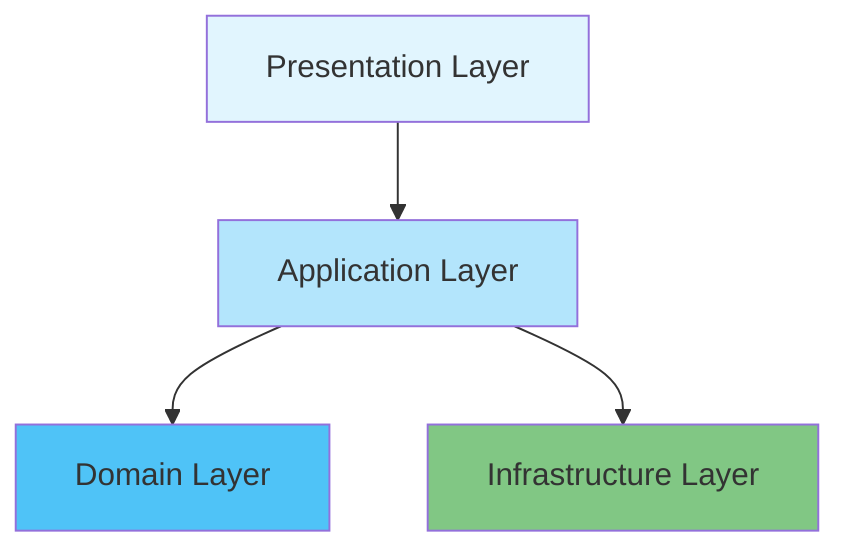

<div align="center">
  
  
  # Squirrel Servers Manager - Server 🐿️

  <p align="center">
    <strong>A comprehensive server management platform built with NestJS</strong>
  </p>

  <p align="center">
    <a href="https://squirrelserversmanager.io">Documentation</a> •
    <a href="#quick-start">Quick Start</a> •
    <a href="#features">Features</a> •
    <a href="#architecture">Architecture</a> •
    <a href="#contributing">Contributing</a>
  </p>

  <p align="center">
    
    
    
    
  </p>
</div>

---

## 🎯 Overview

**Squirrel Servers Manager (SSM)** is the backend service that powers the server management platform. Built on **NestJS** with **Clean Architecture** principles, it provides robust APIs for:

- 🐳 **Container orchestration** and management
- 📚 **Ansible playbook** execution and automation
- 🔐 **SSH/SFTP** secure connectivity
- 📊 **Real-time monitoring** and statistics
- 🔔 **Smart notifications** and alerts
- 🛡️ **Role-based access control**

## 🚀 Quick Start

### Prerequisites

- Node.js 18+ 
- MongoDB 4.4+
- Docker (optional, for container management)
- Ansible (optional, for playbook execution)

### Installation

```bash
# Clone the repository
git clone https://github.com/SquirrelCorporation/SquirrelServersManager.git
cd SquirrelServersManager/server

# Install dependencies
npm install

# Configure environment
cp .env.example .env

# Start development server
npm run dev
```

### Environment Configuration

```env
# Database
DB_HOST=localhost
DB_PORT=27017
DB_NAME=ssm
DB_USER=ssm_user
DB_USER_PWD=your_password
DB_AUTH_SOURCE=admin

# Application
APP_PORT=3000
JWT_SECRET=your_jwt_secret
```

## 🌟 Features

<table>
<tr>
<td width="50%">

### 🐳 Container Management
- Full Docker API integration
- Multi-registry support
- Real-time container stats
- Docker Compose orchestration

</td>
<td width="50%">

### 📚 Ansible Integration
- Playbook execution engine
- Dynamic inventory management
- Galaxy collections support
- Real-time execution logs

</td>
</tr>
<tr>
<td width="50%">

### 🔐 Security & Access
- JWT-based authentication
- Role-based permissions
- SSH key management
- Encrypted credential storage

</td>
<td width="50%">

### 📊 Monitoring & Analytics
- Real-time system metrics
- Custom dashboards
- Alert management
- Performance tracking

</td>
</tr>
</table>

## 🏗️ Architecture

### Clean Architecture Layers



### Module Structure

Each module follows a consistent structure:

```
📦 module-name/
├── 📁 domain/
│   ├── entities/       # Business entities
│   ├── interfaces/     # Repository contracts
│   └── types/         # Domain types
├── 📁 application/
│   ├── services/      # Business logic
│   └── interfaces/    # Service contracts
├── 📁 infrastructure/
│   ├── repositories/  # Data access
│   └── schemas/      # Database models
├── 📁 presentation/
│   ├── controllers/  # REST endpoints
│   ├── gateways/    # WebSocket handlers
│   └── dto/         # Data transfer objects
└── 📁 __tests__/    # Comprehensive tests
```

## 📦 Core Modules

<details>
<summary><b>🎭 Ansible Module</b></summary>

Manages Ansible playbook execution and inventory:
- Dynamic inventory generation
- Playbook repository management
- Real-time execution monitoring
- Galaxy collection support
</details>

<details>
<summary><b>🐳 Containers Module</b></summary>

Complete Docker container lifecycle management:
- Container CRUD operations
- Image management
- Network configuration
- Volume handling
</details>

<details>
<summary><b>🖥️ Devices Module</b></summary>

Remote device management and monitoring:
- SSH connectivity
- System metrics collection
- Health monitoring
- Batch operations
</details>

<details>
<summary><b>👥 Users Module</b></summary>

Authentication and authorization:
- JWT token management
- Role-based access control
- User preferences
- API key generation
</details>

## 🧪 Testing

```bash
# Run all tests
npm test

# Run tests with coverage
npm run test:cov

# Run specific test file
npm run test -- path/to/test.spec.ts

# Watch mode
npm run test:dev
```

### Test Structure
- **Unit Tests**: Service and utility function tests
- **Integration Tests**: Module interaction tests
- **E2E Tests**: Full API endpoint tests

## 📚 API Documentation

The server provides comprehensive API documentation:

- **Swagger UI**: Available at `/api/docs` when running
- **OpenAPI Spec**: Exportable for client generation

## 🔧 Development

### Code Style

We follow strict TypeScript and NestJS conventions:

```typescript
// ✅ Good: Clear separation of concerns
@Injectable()
export class DeviceService implements IDeviceService {
  constructor(
    @Inject('IDeviceRepository')
    private readonly deviceRepository: IDeviceRepository,
  ) {}
}

// ❌ Bad: Direct repository usage in controllers
```

### Build Commands

```bash
# Development
npm run dev

# Production build
npm run build

# Linting
npm run lint:check
npm run lint:fix

# Type checking
npm run typecheck
```

## 🤝 Contributing

We welcome contributions! Please see our [Contributing Guide](../CONTRIBUTING.md) for details.

### Development Workflow

1. Fork the repository
2. Create a feature branch
3. Make your changes with tests
4. Run linting and tests
5. Submit a pull request

## 📄 License

This project is licensed under the GNU Affero General Public License v3.0 - see the [LICENSE](../LICENSE) file for details.

---

<div align="center">
  <p>Built with ❤️ by the Squirrel Corporation team</p>
  
  <a href="https://github.com/SquirrelCorporation/SquirrelServersManager">
    
  </a>
</div>