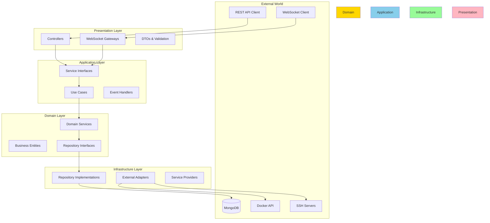
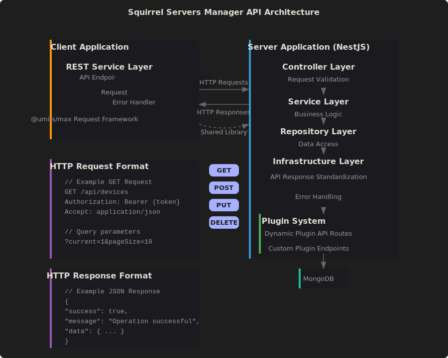

<div align="center">
  <br />
  
  <br />
  <br />
  
  <h1>🐿️ Squirrel Servers Manager - Backend</h1>

  <p align="center">
    <b>The powerful, modular backend powering your server infrastructure management</b>
  </p>

  <br />

  <!-- Quick Links -->
  <p align="center">
    <a href="#-why-ssm-backend"><b>Why SSM?</b></a> •
    <a href="#-quick-start"><b>Quick Start</b></a> •
    <a href="#-features"><b>Features</b></a> •
    <a href="#-architecture"><b>Architecture</b></a> •
    <a href="#-api-docs"><b>API Docs</b></a> •
    <a href="#-contribute"><b>Contribute</b></a>
  </p>

  <br />

  <!-- Badges -->
  <p align="center">
    
    
    
    
    
    
  </p>

  <!-- Stats -->
  <p align="center">
    
    
    
    
  </p>
</div>

<br />

---

## 🌟 Why SSM Backend?

<table>
<tr>
<td width="33%" align="center">
  
  <h3>Clean Architecture</h3>
  <p>Modular, testable, and maintainable code following SOLID principles</p>
</td>
<td width="33%" align="center">
  
  <h3>Enterprise Security</h3>
  <p>JWT auth, role-based access, encrypted storage, and SSH key management</p>
</td>
<td width="33%" align="center">
  
  <h3>Powerful Integrations</h3>
  <p>Native support for Docker, Ansible, SSH, Git, and more</p>
</td>
</tr>
</table>

<br />

## 🚀 Quick Start

### 📋 Prerequisites

<table>
<tr>
<td>

**Required**
- Node.js 18+ (LTS)
- MongoDB 4.4+
- npm or yarn

</td>
<td>

**Optional**
- Docker (for container features)
- Ansible (for playbook features)
- Git (for repository features)

</td>
</tr>
</table>

### 🏃 Get Running in 60 Seconds

```bash
# 1️⃣ Clone and enter the project
git clone https://github.com/SquirrelCorporation/SquirrelServersManager.git
cd SquirrelServersManager/server

# 2️⃣ Install dependencies
npm install

# 3️⃣ Set up your environment
cp .env.example .env
# Edit .env with your settings

# 4️⃣ Start the development server
npm run dev

# 🎉 Server is running at http://localhost:3000
# 📚 API docs at http://localhost:3000/api/docs
```

### 🔧 Essential Configuration

<details>
<summary><b>Environment Variables Guide</b></summary>

```env
# 🗄️ Database Configuration
DB_HOST=localhost               # MongoDB host
DB_PORT=27017                  # MongoDB port
DB_NAME=ssm                    # Database name
DB_USER=ssm_user              # Database user (optional)
DB_USER_PWD=your_password     # Database password (optional)
DB_AUTH_SOURCE=admin          # Auth database (default: admin)

# 🌐 Application Settings
APP_PORT=3000                 # Server port
JWT_SECRET=your-secret-key    # JWT signing secret
NODE_ENV=development          # Environment (development/production)

# 🔐 Security
ENCRYPTION_KEY=32-char-key    # For sensitive data encryption
SESSION_TIMEOUT=3600          # Session timeout in seconds

# 📦 Optional Features
ENABLE_TELEMETRY=false        # Anonymous usage stats
ENABLE_UPDATES=true           # Auto-update checks
LOG_LEVEL=info               # Logging level
```

</details>

<br />

## ✨ Features

### 🎯 Core Capabilities

<table>
<tr>
<td width="50%">

#### 🐳 Container Management
```typescript
// Full Docker API integration
await containerService.create({
  name: 'my-app',
  image: 'nginx:latest',
  ports: { '80/tcp': [{ HostPort: '8080' }] }
});
```
- Complete container lifecycle
- Multi-registry support
- Docker Compose orchestration
- Real-time stats & logs

</td>
<td width="50%">

#### 📚 Ansible Automation
```typescript
// Execute playbooks with real-time feedback
const execution = await ansibleService.runPlaybook({
  playbookPath: 'deploy.yml',
  inventory: 'production',
  extraVars: { version: '2.0' }
});
```
- Dynamic inventory management
- Galaxy collections
- Vault support
- Execution history

</td>
</tr>
<tr>
<td width="50%">

#### 🔐 SSH & Security
```typescript
// Secure remote connections
const session = await sshService.connect({
  host: 'server.example.com',
  username: 'admin',
  privateKey: await keyManager.get('prod-key')
});
```
- SSH key management
- SFTP file transfers
- Tunneling support
- Session pooling

</td>
<td width="50%">

#### 📊 Monitoring & Analytics
```typescript
// Real-time metrics streaming
deviceStats.on('metrics', (data) => {
  // CPU, memory, disk, network stats
  dashboard.update(data);
});
```
- Real-time WebSocket updates
- Custom metric collectors
- Alert management
- Historical data

</td>
</tr>
</table>

### 🛠️ Advanced Features

<details>
<summary><b>🤖 Smart Automation</b></summary>

- **Cron-based scheduling** for recurring tasks
- **Event-driven triggers** for reactive automation
- **Workflow orchestration** with dependencies
- **Failure recovery** with retry strategies

</details>

<details>
<summary><b>🔔 Intelligent Notifications</b></summary>

- **Multi-channel delivery** (Email, Webhook, Slack)
- **Smart grouping** to prevent spam
- **Priority levels** for critical alerts
- **Custom templates** for branded messages

</details>

<details>
<summary><b>📈 Performance Optimizations</b></summary>

- **Connection pooling** for database and SSH
- **Request caching** with Redis support
- **Lazy loading** for heavy operations
- **Background job queues** for async tasks

</details>

<br />

## 🏗️ Architecture

### 📐 Clean Architecture in Action



### 📦 Module Structure

<details>
<summary><b>See Complete Module Anatomy</b></summary>

```
📦 src/modules/example/
├── 📁 domain/                 # Business Logic Core
│   ├── 📄 entities/          # Business entities
│   ├── 📄 interfaces/        # Repository contracts
│   ├── 📄 types/            # Domain types
│   └── 📄 errors/           # Domain exceptions
│
├── 📁 application/           # Use Cases & Services
│   ├── 📄 services/         # Service implementations
│   ├── 📄 interfaces/       # Service contracts
│   ├── 📄 use-cases/       # Business operations
│   └── 📄 events/          # Domain events
│
├── 📁 infrastructure/        # External Integrations
│   ├── 📄 repositories/     # Data persistence
│   ├── 📄 schemas/         # Database models
│   ├── 📄 adapters/        # External services
│   └── 📄 mappers/         # Data transformers
│
├── 📁 presentation/          # API Layer
│   ├── 📄 controllers/      # REST endpoints
│   ├── 📄 gateways/        # WebSocket handlers
│   ├── 📄 dto/             # Request/Response DTOs
│   └── 📄 validators/      # Input validation
│
├── 📁 __tests__/            # Comprehensive Testing
│   ├── 📄 unit/            # Unit tests
│   ├── 📄 integration/     # Integration tests
│   └── 📄 e2e/            # End-to-end tests
│
├── 📄 module.ts            # Module definition
└── 📄 index.ts            # Public exports
```

</details>

### 🧩 Core Modules Deep Dive

<table>
<tr>
<td>

#### 🎭 Ansible Module
```typescript
@Module({
  imports: [CommonModule],
  providers: [
    AnsibleService,
    PlaybookExecutor,
    InventoryManager,
    GalaxyService
  ],
  exports: [AnsibleService]
})
```

</td>
<td>

#### 🐳 Containers Module
```typescript
@Module({
  imports: [CommonModule],
  providers: [
    ContainerService,
    ImageService,
    NetworkService,
    VolumeService
  ],
  exports: [ContainerService]
})
```

</td>
</tr>
</table>

<br />

## 🧪 Testing

### 🎯 Comprehensive Test Coverage

```bash
# 🧪 Run all tests
npm test

# 📊 Generate coverage report
npm run test:cov

# 🔍 Run specific test
npm test -- devices.service.spec.ts

# 👀 Watch mode for TDD
npm run test:watch

# 🚀 E2E tests
npm run test:e2e
```

### 📈 Test Pyramid

<table>
<tr>
<td align="center">
  <h4>Unit Tests</h4>
  <code>src/**/*.spec.ts</code>
  <br />
  Fast, isolated, numerous
</td>
<td align="center">
  <h4>Integration Tests</h4>
  <code>__tests__/integration/</code>
  <br />
  Module interactions
</td>
<td align="center">
  <h4>E2E Tests</h4>
  <code>__tests__/e2e/</code>
  <br />
  Full API flows
</td>
</tr>
</table>

<br />

## 📚 API Documentation

### 🌐 Interactive API Explorer

<div align="center">
  
</div>

Access comprehensive API documentation:

- **Development**: http://localhost:3000/api/docs
- **OpenAPI Spec**: http://localhost:3000/api/docs-json
- **Postman Collection**: Available in `/docs`

### 🔑 Authentication

```bash
# Get JWT token
POST /api/auth/login
{
  "username": "admin",
  "password": "secure-password"
}

# Use token in requests
Authorization: Bearer <your-jwt-token>
```

<br />

## 👨‍💻 Development

### 🛠️ Essential Commands

<table>
<tr>
<td>

**Development**
```bash
npm run dev          # Start dev server
npm run build        # Production build
npm run start:prod   # Production server
```

</td>
<td>

**Code Quality**
```bash
npm run lint         # Check code style
npm run lint:fix     # Auto-fix issues
npm run format       # Format code
```

</td>
<td>

**Testing**
```bash
npm test            # Run tests
npm run test:cov    # Coverage report
npm run test:debug  # Debug tests
```

</td>
</tr>
</table>

### 📝 Code Guidelines

<details>
<summary><b>Best Practices & Examples</b></summary>

#### ✅ Do: Use Dependency Injection
```typescript
@Injectable()
export class DeviceService {
  constructor(
    @Inject('IDeviceRepository')
    private readonly deviceRepository: IDeviceRepository,
    private readonly eventEmitter: EventEmitter2,
  ) {}
}
```

#### ✅ Do: Handle Errors Properly
```typescript
async createDevice(dto: CreateDeviceDto): Promise<Device> {
  try {
    return await this.deviceRepository.create(dto);
  } catch (error) {
    if (error.code === 11000) {
      throw new ConflictException('Device already exists');
    }
    throw new InternalServerErrorException('Failed to create device');
  }
}
```

#### ❌ Don't: Mix Layers
```typescript
// Bad: Controller accessing repository directly
@Controller('devices')
export class DeviceController {
  constructor(private readonly deviceRepo: DeviceRepository) {} // ❌
}
```

</details>

<br />

## 🤝 Contributing

We ❤️ contributions! See our [Contributing Guide](../CONTRIBUTING.md) for details.

### 🌟 How to Contribute

1. 🍴 **Fork** the repository
2. 🌿 **Create** a feature branch (`git checkout -b feature/amazing-feature`)
3. 💻 **Code** your feature with tests
4. ✅ **Test** thoroughly (`npm test`)
5. 📝 **Commit** with conventional commits (`git commit -m 'feat: add amazing feature'`)
6. 🚀 **Push** to your fork (`git push origin feature/amazing-feature`)
7. 🔄 **Open** a Pull Request

### 🏆 Contributors

<a href="https://github.com/SquirrelCorporation/SquirrelServersManager/graphs/contributors">
  
</a>

<br />

## 📄 License

This project is licensed under the **GNU Affero General Public License v3.0** - see the [LICENSE](../LICENSE) file for details.

---

<div align="center">
  <br />
  <p>
    <b>Built with 🥜 by the Squirrel Corporation team</b>
  </p>
  <p>
    <a href="https://squirrelserversmanager.io">Website</a> •
    <a href="https://discord.gg/your-discord">Discord</a> •
    <a href="https://twitter.com/your-twitter">Twitter</a> •
    <a href="https://github.com/SquirrelCorporation/SquirrelServersManager">GitHub</a>
  </p>
  <br />
  
</div>