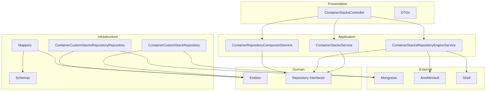

```
  ,;;:;,
   ;;;;;
  ,:;;:;    ,'=.
  ;:;:;' .=" ,'_\
  ':;:;,/  ,__:=@
   ';;:;  =./)_
     `"=\_  )_"`
          ``'"`
```
Squirrel Servers Manager 🐿️
---
# Container Stacks Module

This module provides services for managing container stacks and repositories.

## Architecture

The module follows the Clean Architecture pattern with the following layers:

### Domain Layer

Contains the core business logic, entities, and repository interfaces.

- **Entities**: Define the core business objects
- **Repositories**: Define interfaces for data access

### Application Layer

Contains the application services and use cases.

- **Services**: Implement the business logic
- **Interfaces**: Define the contracts for the services

### Infrastructure Layer

Contains the implementation details for external services and data access.

- **Repositories**: Implement the repository interfaces
- **Schemas**: Define the database schemas
- **Mappers**: Map between domain entities and infrastructure models

### Presentation Layer

Contains the controllers and DTOs for the API.

- **Controllers**: Handle HTTP requests
- **DTOs**: Define the data transfer objects
- **Mappers**: Map between domain entities and DTOs

## Module Structure



## Features

- Manage container stack repositories (Git-based)
- Clone, sync, and update container stack repositories
- Track repository status and errors
- Store and retrieve container stack definitions
- Support for different Git services (GitHub, GitLab, etc.)

## API Endpoints

- `GET /container-stacks-repository`: Get all repositories
- `GET /container-stacks-repository/:uuid`: Get repository by UUID
- `POST /container-stacks-repository`: Add a new repository
- `PUT /container-stacks-repository/:uuid`: Update a repository
- `DELETE /container-stacks-repository/:uuid`: Delete a repository
- `PUT /container-stacks-repository/:uuid/reset-error`: Reset repository error

## Usage

The module exports the `ContainerStacksModule` and `ContainerStacksService` for use in other modules.

```typescript
import { ContainerStacksModule } from './modules/container-stacks';
```

## Testing

The module includes comprehensive tests for all layers:

### Mappers Tests

- **ContainerCustomStackMapper**: Tests mapping between domain entities and persistence models
  - Maps persistence model to domain entity with all properties
  - Handles null/undefined persistence models
  - Maps domain entity to persistence model
  - Handles minimal domain entity

- **ContainerCustomStackRepositoryMapper**: Tests mapping between repository entities and persistence models
  - Maps persistence model to domain entity with all properties
  - Handles null/undefined persistence models
  - Maps domain entity to persistence model
  - Handles minimal domain entity

### Service Tests

- **ContainerRepositoryComponentService**: Tests component management functionality
  - Gets component details
  - Handles component not found
  - Deploys components successfully
  - Handles deployment failures
  - Removes components successfully
  - Handles removal failures

### Controller Tests

- **ContainerStacksController**: Tests API endpoints
  - Stack operations:
    - Gets all stacks
    - Creates a stack
    - Updates a stack
    - Deletes a stack
  - Repository operations:
    - Gets all repositories
    - Gets a repository by UUID
    - Creates a repository
    - Updates a repository
    - Deletes a repository

### Module Tests

- **ContainerStacksModule**: Tests module compilation and dependency injection
  - Verifies module compilation with all dependencies
  - Mocks external dependencies (Mongoose, Auth, Shell, AnsibleVault)
  - Tests module provider configuration

## Services

- **ContainerStacksService**: Manages container stacks and repositories
- **ContainerCustomStacksRepositoryEngineService**: Manages repository operations
- **ContainerRepositoryComponentService**: Manages repository components

## Using the Services

### Managing Container Stack Repositories

```typescript
import { ContainerStacksService } from './modules/container-stacks/services/container-stacks.service';
import { SsmGit } from 'ssm-shared-lib';

@Injectable()
export class MyService {
  constructor(private readonly containerStacksService: ContainerStacksService) {}

  async addGitRepository(
    name: string,
    accessToken: string,
    branch: string,
    email: string,
    userName: string,
    remoteUrl: string,
    gitService: SsmGit.Services,
    matchesList?: string[],
    ignoreSSLErrors?: boolean,
  ) {
    return this.containerStacksService.addGitRepository(
      name,
      accessToken,
      branch,
      email,
      userName,
      remoteUrl,
      gitService,
      matchesList,
      ignoreSSLErrors,
    );
  }
}
```

### Working with the Repository Engine

```typescript
import { ContainerCustomStacksRepositoryEngineService } from './modules/container-stacks/services/container-stacks-repository-engine-service';

@Injectable()
export class MyService {
  constructor(
    private readonly repositoryEngineService: ContainerCustomStacksRepositoryEngineService,
  ) {}

  async initializeRepositories() {
    await this.repositoryEngineService.init();
  }

  async syncAllRepositories() {
    await this.repositoryEngineService.syncAllRegistered();
  }
}
``` 
